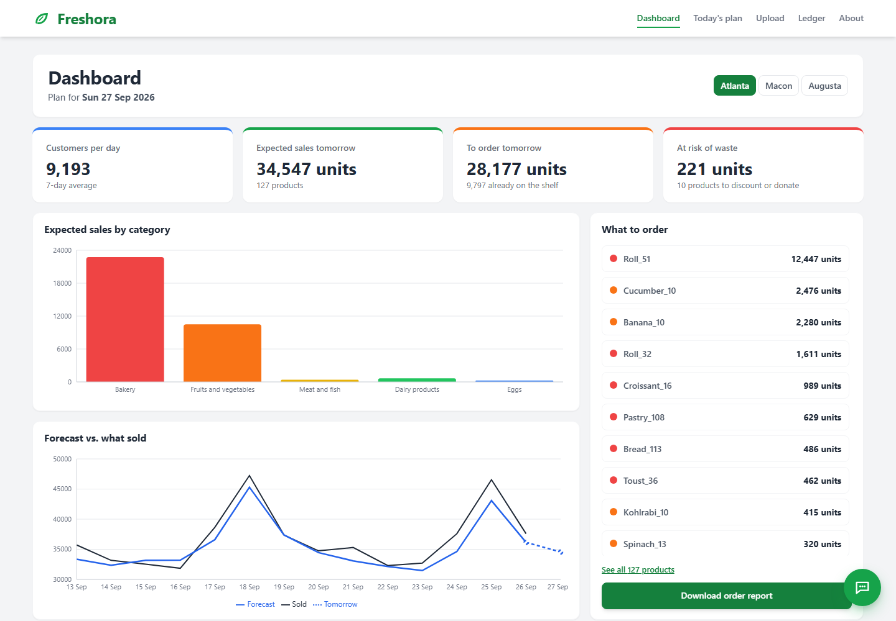
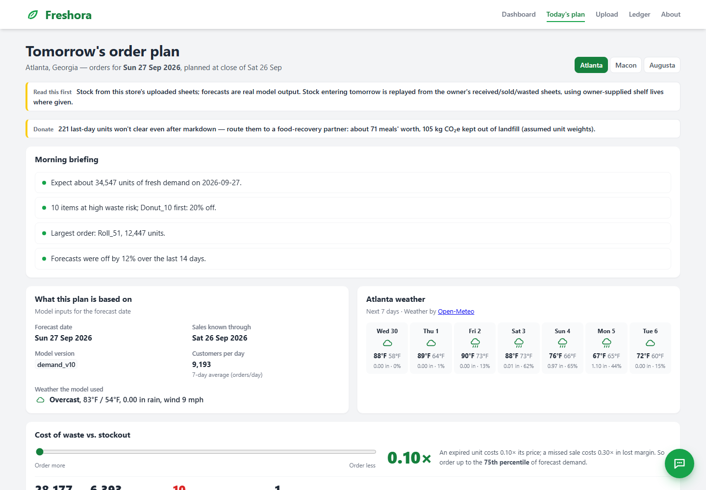

# Freshora

Eliminating food waste, one supermarket at a time: next-day demand forecasts for fresh food that
turn into order quantities, markdowns and donations — and a ledger that checks every forecast
against what actually sold.

> Fork of [at25085/Freshora](https://github.com/at25085/Freshora), built with my team at HackGT 13
> (September 2026). My part: the Python backend, the forecasting model and the data pipeline. After
> the hackathon I reran the model's design studies on a clean three-way time split (below). The
> hosted demo is offline; screenshots below.

## Results

Tested on the last four weeks of real sales the model never saw (2024-05-06 → 2024-06-02; Rohlik
e-grocer, 7 warehouses, real products only):

- **13.7% forecast error (WAPE)**, i.e. 86.3% accurate by volume, vs 22.5% for "same weekday last week" (39% less error).
- **Three-way time split:** train ≤ 2024-01-19, every design choice made on 2024-01-20 → 05-05, test 05-06 → 06-02.
  The test weeks were never used to choose anything; features only use data available the day before (both enforced by tests).

WAPE = Σ|forecast − actual| / Σ actual. Dairy and eggs are synthetic and excluded from the headline.
Details: [docs/DEVPOST.md](docs/DEVPOST.md) · what we learned: [docs/LESSONS.md](docs/LESSONS.md) ·
reports: [`artifacts/`](artifacts).

## Stack

XGBoost · pandas · FastAPI · Tiger Cloud (Postgres + TimescaleDB) · Gemini (store chat) ·
React + TypeScript · Open-Meteo · Docker + Caddy on Vultr.
